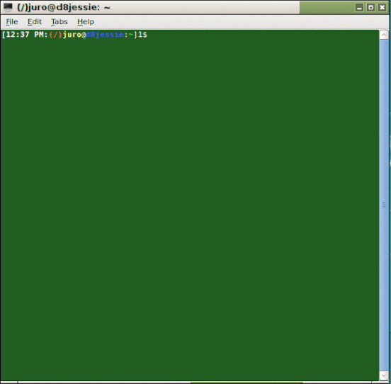

## t3C and t3

`t3C` and `t3` are [Bash](https://www.gnu.org/software/bash/) script (see [Wikipedia:Bash\_(Unix_shell)](https://en.wikipedia.org/wiki/Bash_%28Unix_shell%29) for more info) implementations of the usual [Tic-Tac-Toe (or Noughts-and-Crosses)](https://en.wikipedia.org/wiki/Tic-Tac-Toe) [paper-and-pencil game](https://en.wikipedia.org/wiki/Paper-and-pencil\_game).  

`t3C` is for colored x-terminals while `t3` is for black-and-white x-terminals.  Both bash scripts are two-player implementations of tic-tac-toe.

To play: at the command line, within the directory containing the script issue the command:
```bash
bash t3C
```
(or simply `t3C` if the this script is on your path of executables, i.e., if `echo $PATH` shows a list of directories that includes the directory containing the bash script `t3C`.  To make sure, you can copy these two bash scripts to your `$HOME/.local/bin directory` then add the `.local/bin` directory to your `$PATH`).

A a screenshot (partly edited) is given below.  


## License
<a rel="license" href="http://creativecommons.org/licenses/by/4.0/"></a><br /><span xmlns:dct="http://purl.org/dc/terms/" property="dct:title"><b>mdg2abc</b></span> by <a xmlns:cc="http://creativecommons.org/ns#" href="https://github.com/justineuro/mdg2abc" property="cc:attributionName" rel="cc:attributionURL">Justine Leon A. Uro</a> is licensed under a <a rel="license" href="http://creativecommons.org/licenses/by/4.0/">Creative Commons Attribution 4.0 International License</a>.<br />Based on a work at <a xmlns:dct="http://purl.org/dc/terms/" href="https://github.com/justineuro/mdginabc2svg" rel="dct:source">https://github.com/justineuro/mdg2abc</a>